<h1 align="center">
  
</h1>

<h3 align="center">
  MCA Student @ CET | AI/ML Engineer | Cloud & Automation
</h3>

  Building practical full-stack apps, automation tools, cloud-ready systems, and data-driven solutions.

  <a href="https://github.com/Aarjav-333?tab=repositories">Projects</a>
  .
  <a href="https://www.linkedin.com/in/aarjav-oravakandi/">LinkedIn</a>
  .
  <a href="https://leetcode.com/u/okaarjav/">LeetCode</a>

---

## About Me

- I build web apps, automation tools, and software projects that solve practical real-world problems.
- Currently improving my skills in **AI integration, cloud deployment, Docker, Kubernetes, CI/CD, and machine learning workflows**.
- Building scalable full-stack applications using **ReactJS, Django, Node.js, Express.js, REST APIs, MySQL, MongoDB, Docker, and AWS**.
- Exploring **machine learning, deep learning, PyTorch, CI/CD pipelines, Kubernetes, and cloud-native deployment practices**.
- Open to **internship opportunities, collaborative projects, and software engineering roles where I can contribute and grow**.

---

## Featured Projects

| Project | Description | Tech Stack |
| --- | --- | --- |
| **Loan Bazaar** | Fintech platform for loan management, investments, deposits, role-based access, secure transactions, and real-time financial analytics. | ReactJS, Node.js, Express.js, MongoDB/MySQL, JWT, AWS S3/EC2, Docker |
| **Restaurant Management System** | Restaurant operations system for tables, orders, menu updates, role-based access, and customer feedback. | ReactJS, Node.js, Express.js, MySQL, REST APIs |
| **Result Notifier** | Tracks Kerala University result and announcement updates so students do not need to manually check repeatedly. | React, Supabase, PWA, Automation |
| **Learning Management System** | Learning platform with student accounts, video access, announcements, and dashboard features. | React, Supabase, shadcn/ui, GSAP |

---

## Tech Stack

---

## Core Skills

| Area | Skills |
| --- | --- |
| **Frontend** | ReactJS, JavaScript, TypeScript, HTML, CSS, Tailwind CSS, Bootstrap |
| **Backend** | Node.js, Express.js, RESTful API Design, JWT Authentication |
| **Databases** | MySQL, SQL Server, MongoDB |
| **Cloud & DevOps** | AWS Services, Docker, Kubernetes, CI/CD Pipelines, Git/GitHub |
| **AI & Data** | Machine Learning, Deep Learning, PyTorch, MLOps |
| **Tools** | Postman, Figma, MS Excel, VS Code |

---

## Highlights

- Designed and deployed an end-to-end full-stack application with cloud integration
- Deployed scalable microservices using Docker and Kubernetes
- Implemented cloud-based solutions using AWS
- Built Python automation pipelines for data processing and workflow optimization
- Developed and deployed machine learning pipelines

---

## GitHub Metrics

  

  

  

  

---

## Connect With Me

&nbsp;

&nbsp;

  

---

### Building with code, curiosity, and consistency

